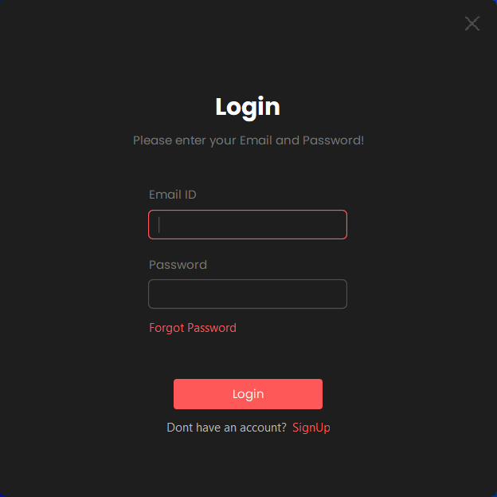
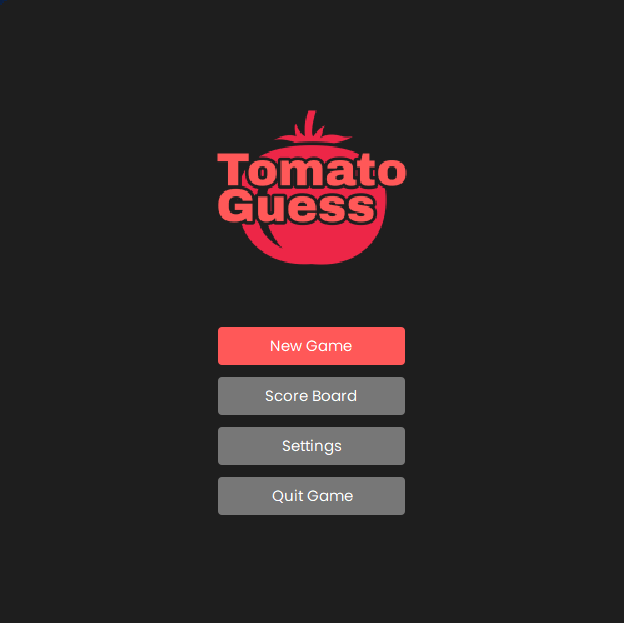
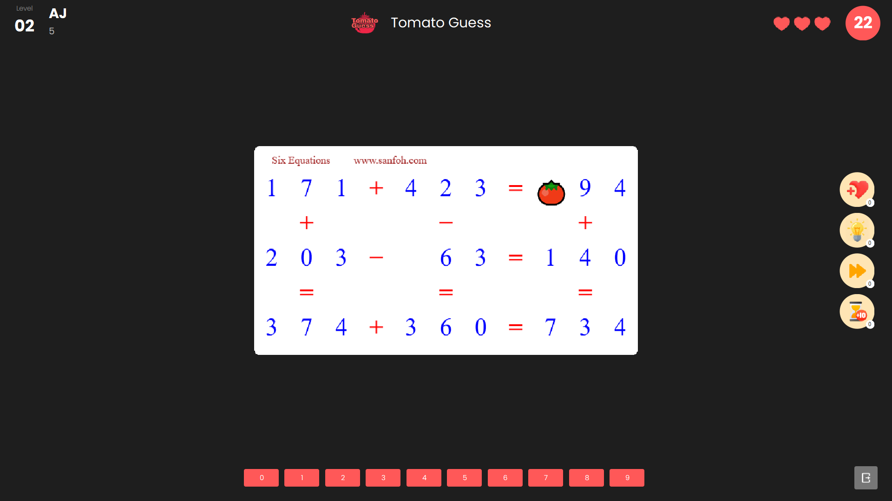
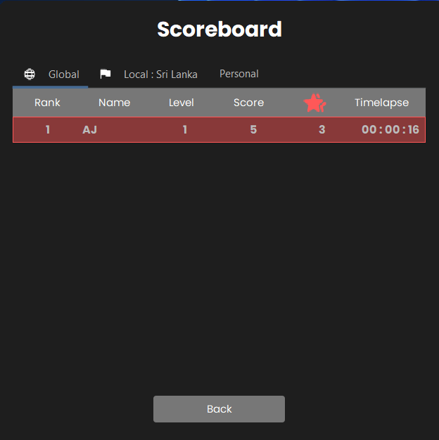
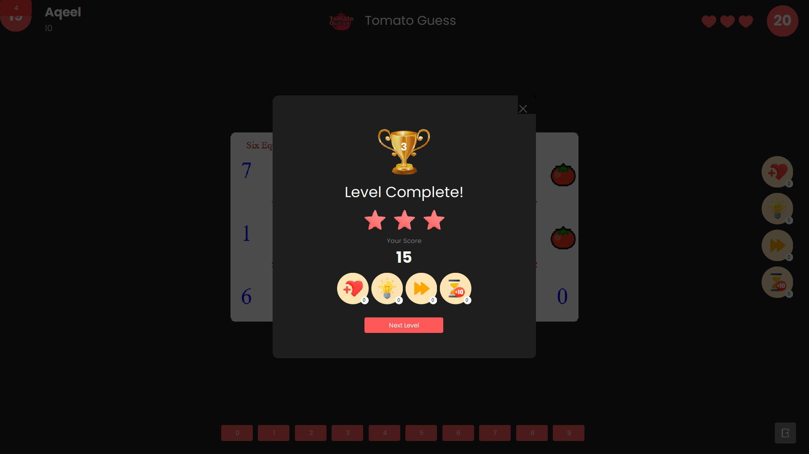
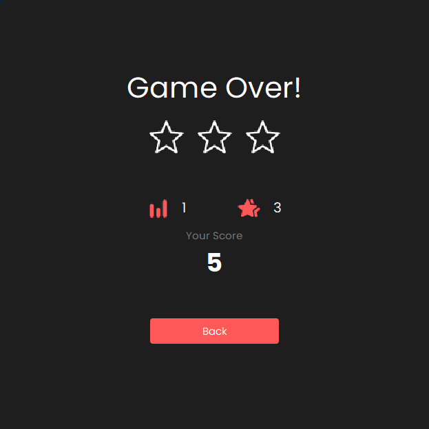

# 🍅 TomatoGuess

 
  <b>A Java-based Interactive Math Puzzle Game powered by the Tomato Game API</b>

 Built with Java • Swing • Maven • REST API Integration • OOP Principles 

---

## 📌 Overview

**TomatoGuess** is a Java desktop application that dynamically retrieves mathematical puzzle images from the Tomato Game API and challenges users to solve them in real time.

The application integrates with an external REST API, processes JSON/CSV responses, decodes Base64 images, and validates user input against API-provided solutions — all within a structured, object-oriented architecture.

This project highlights practical experience in:

- REST API consumption in Java
- JSON & CSV parsing
- Base64 image decoding
- HTTP communication handling
- Clean architecture principles
- Maven project management
- GUI development using Swing

---

## 🎮 How It Works

1. The application sends an HTTP request to the Tomato Game API.
2. The API returns a math puzzle image and its correct answer.
3. The image is displayed inside the Swing interface.
4. The user submits an answer.
5. The system validates the answer against the API solution.
6. The scoreboard updates based on performance.
**🎯 Objective:** Solve accurately, improve speed, and beat your highest score.

---

## 🖼️ Screenshots

### Login Screen

  

### Account Creation

  

### Main Menu

  

### Gameplay

  

### Scoreboard

  

### Game Success

  

### Game Over

  

---

## 🍅 Tomato Game API Integration

### 🔎 What is the Tomato Game API?

The Tomato Game API is a web-based service created by Marc Conrad that generates mathematical puzzle images along with their solutions.

It provides:

- A puzzle image (URL or Base64 encoded)
- The correct solution
- Output formats in JSON or CSV

---

### 🌐 API Base URL
http://marcconrad.com/uob/tomato/api.php

### ⚙️ Supported Parameters

| Parameter | Default | Description |
|------------|----------|-------------|
| `out` | `json` | Response format (`json` or `csv`) |
| `base64` | `no` | Returns image encoded in Base64 if `yes` |

---

### 📦 Example Requests

**Default JSON Response**
http://marcconrad.com/uob/tomato/api.php

**JSON with Base64 Image**
http://marcconrad.com/uob/tomato/api.php?out=json&base64=yes

**CSV Response**
http://marcconrad.com/uob/tomato/api.php?out=csv

---

### 🧠 How TomatoGuess Uses the API

Inside the application:

- An HTTP request is sent to the API endpoint.
- The JSON response is parsed using Java JSON libraries.
- The puzzle image is:
  - Loaded via URL **or**
  - Decoded from Base64 into a `BufferedImage`
- The solution is extracted and stored temporarily.
- User input is validated against the solution.
- The scoreboard updates accordingly.

This demonstrates practical experience with:

- RESTful API integration
- Data transformation
- Exception handling
- Layered architecture
- Clean separation between UI, logic, and API communication

---

## 🧩 Architectural & Design Concepts Applied
While not a large enterprise system, the project demonstrates important architectural thinking:
- **Event-Driven UI Flow**– User actions trigger controlled state changes.
- **Layered Architecture** – UI, API layer, and business logic are separated.
- **Interoperability** – Seamless communication between a Java desktop client and a remote web service.
- **Virtual Identity** Concept – Local score tracking representing user performance history.

---

## 🛠️ Technologies

- Java 17+
- Java Swing (GUI)
- Maven
- REST API (HTTP)
- JSON Parsing
- Base64 Image Decoding
- Object-Oriented Programming Principles

---

## 🚀 Installation
**Prerequisites**
- Java 17 or higher
- Maven installed
- Internet connection (required for API calls)

**Steps**
1. Clone the repository:
   `git clone https://github.com/Aqeel-J/TomatoGuess.git`

2. Navigate into the project directory:
   `cd TomatoGuess`

4. Build the project:
   `mvn clean install`

5. Run the application:
   `mvn exec:java`

## 👨‍💻 Author
Aqeel Jabir
Java Developer | API Integration | Desktop Application Development  
Passionate about clean architecture, scalable systems, and practical problem solving.

## 📜 Credits

Tomato Game API by Marc Conrad (2022).
Material provided "as is" with no warranty implied.

